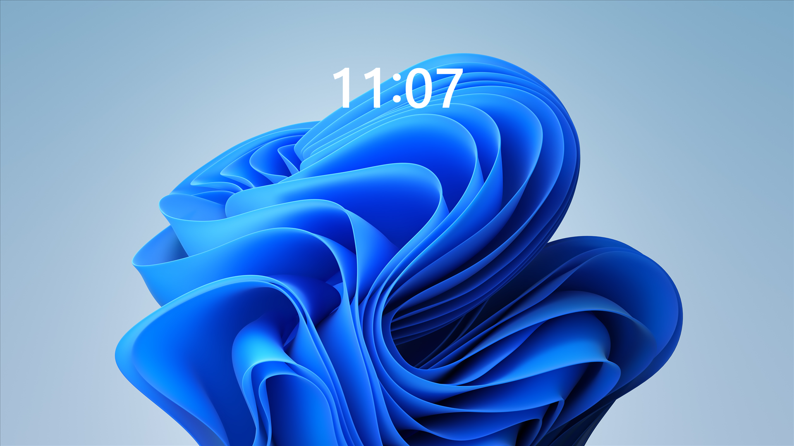
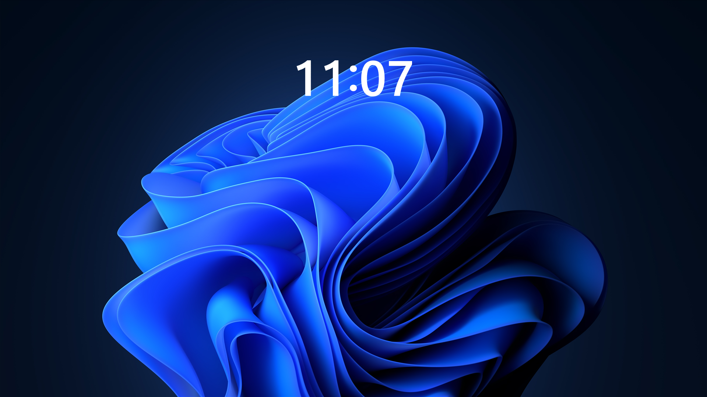

<div align="center">

# Windows Desktop Clock

A clean, lightweight replica of the Windows 11 lock screen clock that lives on your desktop.

<a href="https://github.com/haitamoudah/windows-desktop-clock/releases/latest"></a>

<a href="license"></a>

<br />
<br />



<br />
<br />



</div>

## Features

- **Pixel-accurate lock screen look**: same font (Segoe UI Variable Display SemiBold), same size, same position, same centered colon as the Windows 11 lock screen
- **Lives on the desktop**: sits behind every window and survives Win+D / Show Desktop, so it never covers your apps
- **Click-through**: your mouse goes right past it, icons and wallpaper stay fully usable
- **Adapts to you**: follows your system font and your 12/24-hour time format
- **Featherweight**: wakes once per minute, invisible to Alt-Tab, never steals focus

## Installation

1. Download the latest zip from [releases](https://github.com/haitamoudah/windows-desktop-clock/releases)
2. Extract it anywhere
3. Run `windows-desktop-clock.exe`

Requires the [.NET 10 Desktop Runtime](https://dotnet.microsoft.com/download/dotnet/10.0). Windows offers to install it automatically if it's missing.

## Usage

- The clock appears centered on your desktop, exactly where the lock screen puts it
- Right-click the tray icon for `About` / `Quit`
- To start it with Windows: press `Win + R`, type `shell:startup`, and drop a shortcut to the exe there

## Building From Source

```
git clone https://github.com/haitamoudah/windows-desktop-clock.git
cd windows-desktop-clock
dotnet run
```

## License

Released under the [MIT License](license).
